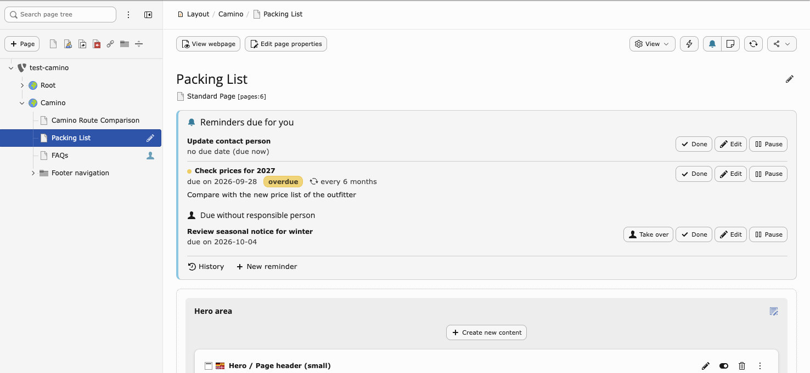
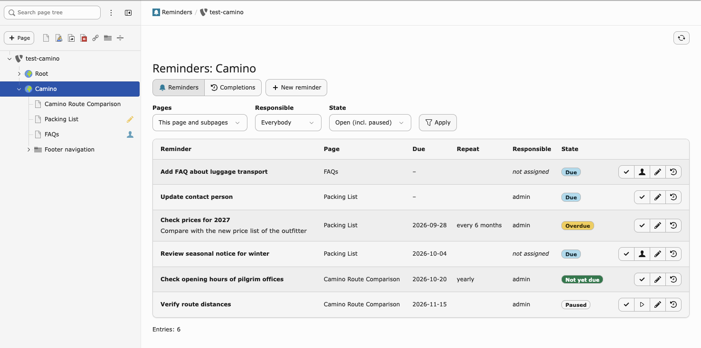
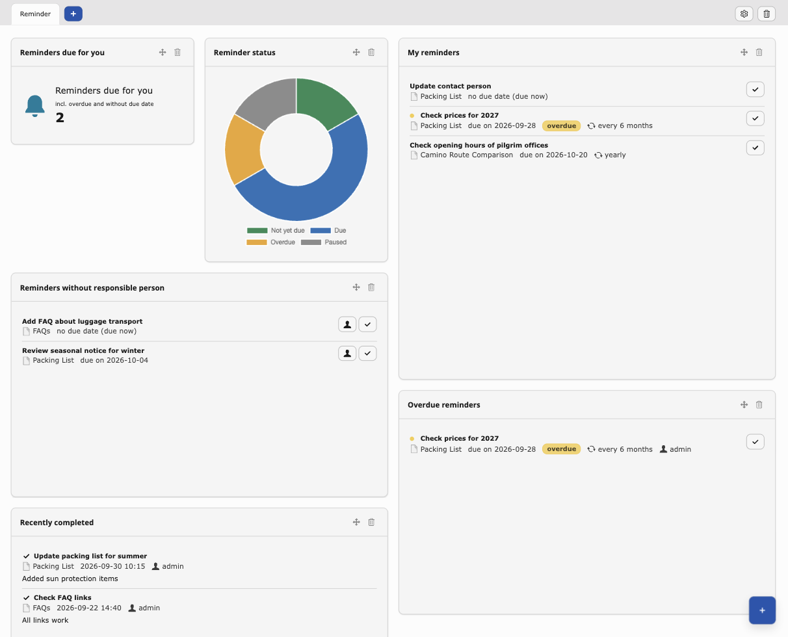

# Content Reminder for TYPO3

Reminders attached to TYPO3 pages – with due date, optional recurrence,
responsible person and an archive of completed tasks – so that editorial
content such as prices, seasonal notes or contact persons stays up to date.

| | |
|---|---|
| Extension key | `content_reminder` |
| Composer | `formatsoft/content-reminder` |
| TYPO3 | 13.4 LTS, 14.x |
| PHP | 8.2 – 8.5 |
| License | GPL-2.0-or-later |

## Screenshots

**Page module** – reminders due for you above the content elements; the page
tree marks pages with due reminders (pencil: due for you, person: due without
responsible person):



**Backend module** *Content → Reminders* – all reminders of a page and its
subpages, with filters and actions:



**Dashboard** – preset *Content maintenance* with the reminder widgets:



## Features

- **Reminders on pages** with title, notes, optional due date (empty = due
  now) and a responsible backend user. Reminders are language independent.
- **Recurrence**: every *n* days, weeks, months or years. The next due date
  is counted from the day of completion; month ends are handled correctly
  (31 Aug + 6 months = 28/29 Feb).
- **Archive**: every completion is logged with date, person and optional
  comment. The archive survives the deletion of pages and reminders.
- **Page tree**: a pencil icon marks pages with reminders that are due for
  you, a person icon marks pages with due reminders nobody is responsible for.
- **Page module**: a panel above the content elements shows your due
  reminders with the actions *Done*, *Take over*, *Edit* and *Pause*, plus
  links to all reminders of the page and to the completion history.
- **List module**: filter *Only mine* / *Only due* and row actions
  *Done*, *Take over*, *Resume*, *Reopen* and *Completion history*.
- **Dashboard**: widgets *My reminders*, *All reminders*, *Without
  responsible person*, *Overdue*, *Recently completed*, a counter and a status
  chart – and the dashboard preset *Content maintenance*.
- **Backend module** *Content → Reminders* with page tree: all reminders of
  the selected page and its subpages (or of all accessible pages), filtered
  by person and state, with actions – and the archive of completions,
  filtered by person and period.
- **Weekly email**: on a configurable weekday every responsible person gets
  one email per site with their overdue reminders and those due within the
  next days (German or English, depending on the user's backend language).
  Users can opt out in their user settings.

## Installation

```bash
composer require formatsoft/content-reminder
```

Then update the database schema, e.g.:

```bash
vendor/bin/typo3 extension:setup -e content_reminder
```

Optionally add the site set **Content Reminder** (`formatsoft/content-reminder`)
as a dependency of your site to configure the extension per site.

## Permissions

Permissions are based on standard TYPO3 access rights; there is no separate
permission management. Administrators may do everything. For editors, set up
the backend user group as follows:

1. **Table permissions** (tab *Record Permissions*, field *Table permissions*):
   set the table *Reminder* to *Read* (see reminders) or *Read & Write*
   (create, complete, take over, edit reminders).
2. **Page permissions** (module *Permissions*): users need
   *Show page* to see the reminders of a page and *Edit content* to create,
   complete or take over reminders on it. The pages must be part of the
   group's mounts (tab *Mounts*: *DB Mounts* in TYPO3 v13, *Page Tree Entry
   Points* in v14).
3. **Custom options** (tab *Module Permissions*, field *Custom module
   options*, section *Content Reminder*), both optional:
   - *Assign reminders to other users* – assign reminders to colleagues and
     change the responsible person
   - *Manage all reminders* – edit, complete and delete reminders of others
4. **Modules and widgets** (tab *Module Permissions*):
   - *Allowed modules*: the backend module *Reminders* (below *Web* in TYPO3
     v13, below *Content* in v14)
   - *Allowed dashboard widgets*: the widgets of the group *Content Reminder*

The page tree markers, the panel in the page module and the filters and
actions in the list module need no additional permission.

In the table, *read access* means table permission *Read* and page
permission *Show page*; *write access* means *Read & Write* and *Edit
content*. All actions require at least read or write access to the page.

| Action | Allowed for |
|---|---|
| See reminders and completion history of a page | read access |
| Create a reminder for oneself / unassigned | write access |
| Assign a reminder to somebody else, change the responsible person | *Assign reminders to other users* |
| Take over an unassigned reminder | write access |
| Take over a reminder assigned to somebody else | *Assign …* or *Manage all …* |
| Give a reminder back (unassign) | responsible person, *Assign …*, *Manage all …* |
| Edit, pause, resume, reopen | creator, responsible person, *Manage all …* |
| Mark as done | responsible person; anybody with write access if unassigned; *Manage all …* |
| Delete | creator, *Manage all …* |

The rules are enforced for every write access through the DataHandler
(editing form, list module, clipboard, API). If a reminder is assigned to a
person without access to the page, it is saved with a warning.

## Configuration (site settings)

Add the site set **Content Reminder** (`formatsoft/content-reminder`) as a
dependency of your site to edit these settings in the backend.

| Setting | Default | Description |
|---|---|---|
| `contentReminder.assignableGroups` | empty (all) | Comma-separated list of backend user group uids whose members can be assigned |
| `contentReminder.backendUrl` | derived from site base | Backend URL for links in emails, e.g. `https://example.org/typo3`. Required if the site base has no domain (e.g. `/`). |
| `contentReminder.mail.enabled` | `true` | Send the weekly email for this site |
| `contentReminder.mail.weekday` | `monday` | Weekday of the weekly email |
| `contentReminder.mail.lookaheadDays` | `7` | Reminders due within this number of days are included in addition to overdue ones |
| `contentReminder.mail.fromAddress` / `fromName` | system default | Sender of the weekly email |
| `contentReminder.mail.unassignedRecipient` | empty | Address that receives the reminders without responsible person; empty = not mailed |

## Weekly email

The command `content-reminder:send-weekly-mail` sends the emails. Run it
**daily**, e.g. with the scheduler task *Execute console commands*: each site
is processed on its configured weekday and at most once per day.

```bash
# What would be sent (ignores weekday and "already sent today")
vendor/bin/typo3 content-reminder:send-weekly-mail --dry-run --force

# Send now for one site
vendor/bin/typo3 content-reminder:send-weekly-mail --site=main --force
```

Recipients are the responsible persons with a valid email address who have
not opted out (*User settings → Do not send me the weekly email with due
reminders*). Reminders without responsible person are sent to
`contentReminder.mail.unassignedRecipient`, if set.

## Archive cleanup

The archive table `tx_contentreminder_reminder_log` is registered for the
scheduler task *Table garbage collection*, based on the completion date. The
default retention is **2 years (730 days)**; it also applies if a task cleans
up *all tables*. For a different retention, create a task for
`tx_contentreminder_reminder_log` only and set *Delete entries older than
given number of days*.

The archive is deliberately not listed in *Maintenance → Clear persistent
database tables*, which empties tables completely.

## Translations

The extension ships English and German labels. Further languages are
translated on [Crowdin](https://crowdin.com/) as part of the TYPO3
translation server and installed as language packs via *Maintenance →
Manage Language Packs*. Contributions are welcome.

Labels are added and changed in the English source files only
(`Resources/Private/Language/*.xlf`, `Configuration/Sets/*/labels.xlf`); a
GitHub workflow uploads them to Crowdin on every push to `main`.

## Development

Dependencies for the tests are installed into `.Build/` of the extension:

```bash
composer install
composer phpstan
composer test:unit
```

PHPStan runs on level 8. Code that differs between TYPO3 v13 and v14 is listed in
`Build/phpstan/version-compatibility.neon`; run the analysis against both versions.

Functional tests need a database user that may create databases, e.g. in DDEV:

```bash
typo3DatabaseDriver=mysqli typo3DatabaseHost=db typo3DatabaseUsername=root \
typo3DatabasePassword=root typo3DatabaseName=ft_content_reminder \
composer test:functional
```

To test against TYPO3 v13 instead of the latest version:

```bash
composer update --with "typo3/cms-core:^13.4" --with "typo3/cms-backend:^13.4" --with "typo3/cms-dashboard:^13.4" --with "typo3/cms-scheduler:^13.4" --with "typo3/cms-setup:^13.4"
```

## License

GPL-2.0-or-later, see [LICENSE.txt](LICENSE.txt).
